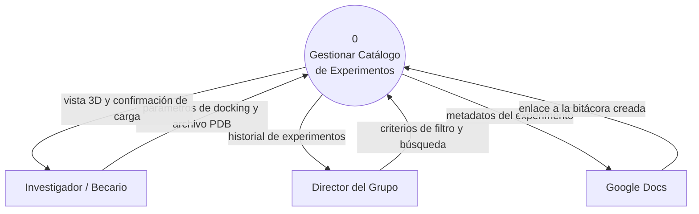

# **Canvas de Descubrimiento**

### **Dominio y Problema**
En un grupo de investigacion pequeño (ej. un lab de facultad) que corre experimentos computacionales: docking molecular, MD, ensamblados genomicos. Los registros de lo que se probó, sus parámetros y los resultados queda disperso en diversas carpetas locales, con nombres de archivos poco descriptivos y comunicación informal entre pares. Hoy esto se resuelve (mal) con planillas sueltas o memoria de quien hizo cada cosa. Esto tiene como consecuencia que se suelen repetir ensayos ya hechos, y para revisar un resultado hay que descargar el archivo y abrir un programa para su visualización.

### **Datos**
Metadatos estructurados por experimento: tipo, parámetros de entrada, fecha, autor, hipótesis, resultado/estado. Para el MVP (docking), además el archivo de resultado en formato PDB (estructura de la pose obtenida) para el visor de solo lectura. Los datos son generados por los propios integrantes del grupo por lo que no dependen de ninguna fuente ni API externa para funcionar.

### **Usuarios y Stakeholders**
Investigador/estudiante: cargan experimentos nuevos, buscan si algo similar ya se probó antes de correrlo.
Director/responsable del grupo: consulta el historial completo para tener panorama del avance sin pedirle a cada integrante que le comente absolutamente todo.
No usuario directo pero interesado: la cátedra/docente, en tanto es quien evalúa el proyecto,no interactúa con el sistema en producción. 

### **Valor**
Si el sistema funciona, nadie repite un experimento ya realizado sin saberlo, no hace falta abrir software externo (VMD, PyMOL, etc) solo para mirar el resultado, y por ultimo, el proyecto queda consultable para cualquier duda y para un integrante que se suma al grupo posteriormente.

### **Alcance Realista**
*Adentro del sistema*
* Alta, consulta y filtro de experimentos de un solo tipo: docking.
* Campos: molécula/proteína, ligando, software usado, parámetros clave, sitio activo, autor, fecha, hipótesis, estado (éxito/fallido/en curso).
* campo de notas simple por experimento, de un solo autor por vez, dentro del propio sistema.
* Detección de posible duplicado (mismo tipo + misma molécula/ligando ya cargado antes).
* Visor 3D de solo lectura de la pose resultante (vía 3Dmol.js u otra librería equivalente), sin cálculo ni análisis adicional.
* Vínculo con Google Docs: crear/asociar un documento de notas por experimento.

*Afuera del sistema*
* Dinámica molecular y BLAST/ensamblados. --> Quedan como extensión futura, no en esta entrega.
* Reproducción de trayectorias completas de MD (múltiples frames). --> Solo pose estática.
* Cualquier análisis, cálculo o edición sobre los resultados dentro del sistema. --> Es visualización pura.
* Edición colaborativa en tiempo real de las notas dentro del sistema, eso vive en Google Docs, el sistema solo enlaza/crea.

### **Riesgos de Fracaso** 
El más probable en nuestro caso es el cambio de requerimientos. Si el modelo de datos de docking queda armado con columnas fijas muy específicas de esa técnica, agregar otra técnica después obliga a rehacer el esquema. 
* Mitigación: diseñar la tabla de "parámetros del experimento" como estructura extensible (ej. clave-valor o JSON) en vez de columnas rígidas por técnica, para que sumar dinámica molecular más adelante sea agregar filas de parámetros nuevos, no rediseñar la base.

### **Datos Sensibles**
Los metadatos de experimentos no son datos clínicos ni biológicos de una persona — son datos de investigación (moléculas, parámetros, resultados). El único dato mínimamente personal es el nombre del autor de cada experimento (miembro del propio grupo), que no cae dentro de las categorías que exige proteger el Código de Ética IEEE/ACM (no es dato de salud, no es identificable de un tercero ajeno al proyecto).

# **DFD nivel 0**

# **Stakeholders y roles
## 2. Stakeholders y roles

| Rol | Tipo | Interacción con el sistema | Permisos |
|---|---|---|---|
| Investigador/a o becario/a | Usuario directo | Carga experimentos de docking, consulta el catálogo antes de correr un ensayo nuevo, visualiza poses 3D, agrega notas | Alta de experimentos propios; edición/borrado solo de los experimentos que él/ella cargó; consulta y búsqueda sobre todo el catálogo (necesario para detectar duplicados) |
| Director/a del grupo | Usuario directo | Consulta el historial completo del grupo, filtra y busca sin necesidad de pedir el dato a cada integrante | Consulta total del catálogo; edición/borrado de cualquier experimento del grupo (responsabilidad última sobre la integridad de los datos) |
| Cátedra/docente | Interesado, no usuario | Evalúa el proyecto en las instancias de presentación; no interactúa con el sistema en producción | No aplica — no opera el sistema |

**Nota sobre el diseño de permisos**: la distinción de roles entre investigador/a y director/a evita que la carga de un integrante sea modificada o eliminada por otro sin autorización, preservando la trazabilidad histórica que es el valor central del sistema. Ver bloque "Valor" en la sección 1.